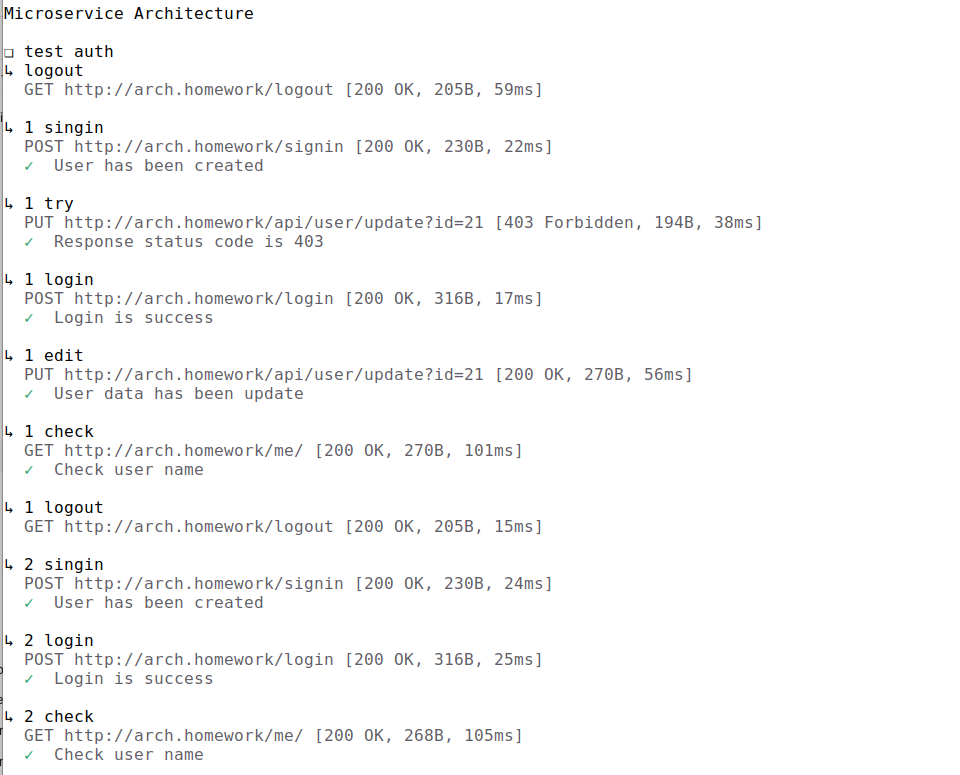

## Домашнее задание

### Запустить minikube
minikube start

### Запустить туннель
minikube tunnel

### Установить prometheus (ДЛЯ ЭТОГО ДЗ НЕ ТРЕБУЕТСЯ)
helm repo add prometheus-community https://prometheus-community.github.io/helm-charts
helm repo update
helm upgrade --install prometheus prometheus-community/kube-prometheus-stack -f "./.helm/prometheus/values.yaml"

### Установить ingress
helm repo add ingress-nginx https://kubernetes.github.io/ingress-nginx/
helm repo update
helm upgrade --install nginx ingress-nginx/ingress-nginx -f "./.helm/nginx-ingress/values.yaml"

### Установить postgres
kubectl apply -f https://raw.githubusercontent.com/rancher/local-path-provisioner/master/deploy/local-path-storage.yaml

helm upgrade --install app-postgres oci://registry-1.docker.io/bitnamicharts/postgresql -f  "./.helm/postgres/values.yaml"

### Запустить приложение
helm upgrade --install app ./.helm/app

### Запустить сервис авторизации
helm upgrade --install app-auth ./.helm/app-auth

### Запустить сервис биллинга
helm upgrade --install app-billing ./.helm/app-billing

### Запустить сервис нотификаций
helm upgrade --install app-notify ./.helm/app-notify

### Сценарий взаимодействия

### Запуск тестов newman
newman run ./postman/collection.json --folder "test auth"

### Удалить приложение
helm upgrade --uninstall app

### Удалить postgres
helm uninstall app-postgres
kubectl delete -n default persistentvolumeclaim data-app-postgres-postgresql-0