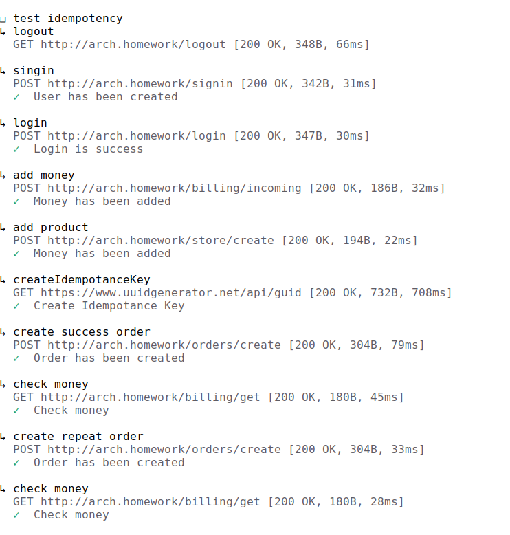
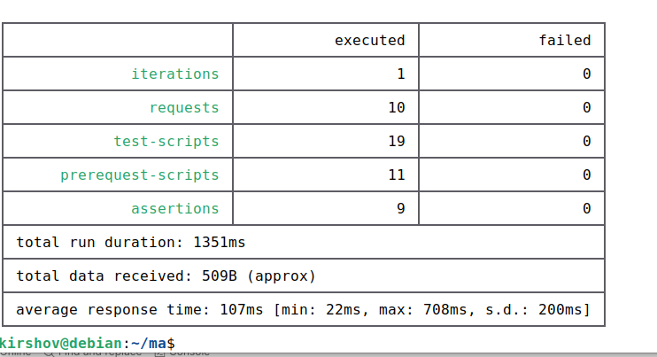

## Установить проект
### Установить сервисы
namespace = kirshov-otus (указан в make файле)

make init
### Установить все приложения
make install-all

### Запуск тестов newman
newman run ./postman/collection.json --folder "test saga"

## Удалить проект
uninstall-all

