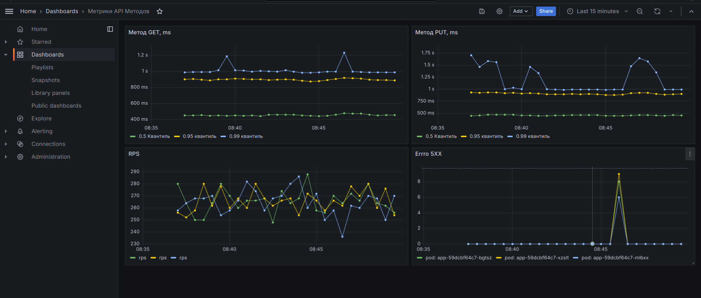
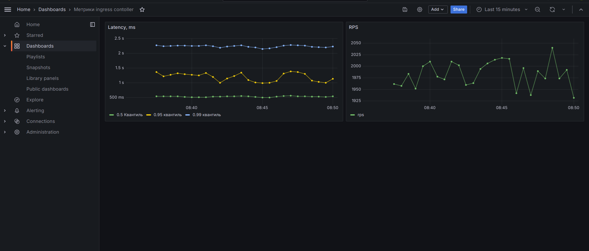

## Домашнее задание

[Ссылка на коллекцию Postman](https://api.postman.com/collections/25030056-95baae54-f656-4982-9b04-74b4f8ebb3f6?access_key=PMAT-01HR7T1X626SYX2ED4BTFV4E4F)

### Запустить minikube
minikube start

### Запустить тунель
minikube tunnel

### Установить ingress
helm repo add ingress-nginx https://kubernetes.github.io/ingress-nginx/
helm repo update
helm upgrade --install nginx ingress-nginx/ingress-nginx -f "./.helm/nginx-ingress/values.yaml"

# Установить postgres
kubectl apply -f https://raw.githubusercontent.com/rancher/local-path-provisioner/master/deploy/local-path-storage.yaml

helm upgrade --install app-postgres oci://registry-1.docker.io/bitnamicharts/postgresql --namespace=m -f  "./.helm/postgres/values.yaml"

### Запустить приложение
helm upgrade --install app ./.helm/app

### Удалить приложение
helm upgrade --uninstall app

### Удалить postgres
helm uninstall app-postgres --namespace=m

### Установить prometheus
helm repo add prometheus-community https://prometheus-community.github.io/helm-charts
helm repo update
helm upgrade --install prometheus prometheus-community/kube-prometheus-stack -f "./.helm/prometheus/values.yaml"

### Опционально:
#### Пробросить порт prometheus
kubectl port-forward service/prometheus-operated 9090
#### Пробросить порт grafana
kubectl port-forward service/prometheus-grafana 3000:80
Доступ к grafana admin/prom-operator

### Метики
[JSON метрик приложения](grafana/app-dashboard.json)

[JSON метрик Ingress Controller](grafana/ingress-dashboard.json)
